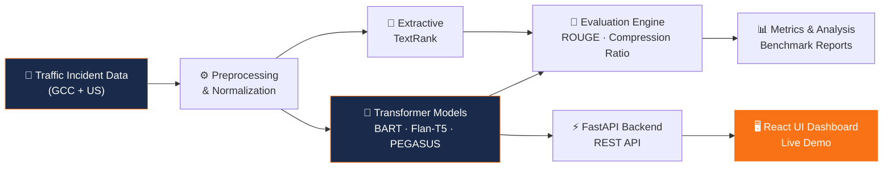

<!-- Dynamic Header Banner -->

<!-- Typing SVG -->

<!-- Social Badges -->
 

  

---

## 👤 About Me

> *"I build real-world AI systems that turn complex data into clarity — at the intersection of intelligent automation, cloud engineering, and domain expertise."*

I am a **Senior Manager** specializing in **Data Governance, Advanced Analytics, and AI-driven systems**, with **20+ years of experience** across financial services, transportation, and enterprise technology.

Currently pursuing a **Master of Science in Artificial Intelligence** at [Canadian University Dubai](https://www.cud.ac.ae/), with active research on:
- 🏗️ **Data Center Optimization** using AI & intelligent workload management
- 🚦 **LLM-based Traffic Incident Summarization** for Smart Mobility
- 📊 **Enterprise Data Architecture** & Regulatory Analytics

---

## 🚀 Current Focus

<table>
<tr>
<td width="50%">

**🧠 AI & Machine Learning**
- LLM fine-tuning & prompt engineering
- BART, Flan-T5, PEGASUS, TextRank
- ROUGE evaluation & model benchmarking
- Extractive vs Abstractive summarization

</td>
<td width="50%">

**☁️ Engineering & Infrastructure**
- FastAPI + React full-stack deployment
- Docker & Hugging Face Spaces
- Smart Mobility & ITS systems
- Data Governance & MDM frameworks

</td>
</tr>
</table>

---

## ⭐ Featured Project — Traffic Incident Summarization

> An AI-powered system that converts long, raw traffic incident reports into concise, structured summaries using state-of-the-art transformer models.

**Key Highlights:**

| Feature | Detail |
|---|---|
| 🤖 **Models** | BART-Large-CNN · Flan-T5 · PEGASUS · TextRank |
| 📊 **Best ROUGE-1** | `0.432` (BART-Large — 35.8% above baseline) |
| 🗂️ **Datasets** | GCC/UAE (250+ narratives) + US Accidents (5,000+ records) |
| 🖥️ **Stack** | FastAPI · React · Docker · Hugging Face Spaces |
| 📈 **Methodology** | Extractive vs Abstractive benchmarking |

---

## 🏗️ System Architecture

---

## 🛠️ Technical Stack

**Languages & Frameworks**

**AI & Data**

**Cloud & DevOps**

---

## 📊 GitHub Stats

 

---

## 🎓 Education & Credentials

| Qualification | Institution | Status |
|---|---|---|
| 🎓 MS Artificial Intelligence | Canadian University Dubai | 📚 In Progress |
| 💼 Senior Manager — Data & Analytics | Financial Services & Transportation | ✅ 20+ Years |
| 🏅 Data Governance & MDM | Enterprise-scale deployments | ✅ Specialized |

---

<!-- Footer Wave -->

*Built with ❤️ in Dubai • MS AI @ Canadian University Dubai*

