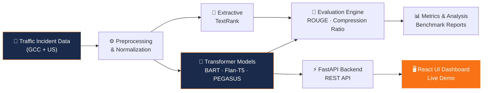

# 👨‍💻 Rajeev Ranjan Pandey
### Senior Manager — AI & Data Strategy | 3X Tableau Zen Master | 5X Ambassador

  
  
  
  

<!-- Professional Intro -->
> *"Building real-world AI systems & architecting data excellence since 2004."*

---

### 👤 About Me
I am a **Senior Manager** specializing in **Data Governance, Advanced Analytics, and AI-driven systems**, with **20+ years of experience** across financial services, transportation, and enterprise technology.

Currently pursuing a **Master of Science in Artificial Intelligence** at [Canadian University Dubai](https://www.cud.ac.ae/), with active research on:

- 🏗️ **Data Center Optimization** using AI & intelligent workload management.
- 🚦 **LLM-based Traffic Incident Summarization** for Smart Mobility.
- 📊 **Enterprise Data Architecture** & Regulatory Analytics.

---

### 🚀 Current Focus

#### 🧠 AI & Machine Learning
- **LLM Fine-tuning:** BART, Flan-T5, PEGASUS, TextRank. 
- **Methodology:** Balancing Extractive vs Abstractive summarization. 
- **Metrics:** ROUGE evaluation & robust model benchmarking.

#### ☁️ Engineering & Infrastructure
- **Full-Stack:** FastAPI + React integrated deployments. 
- **DevOps:** Docker containers & Hugging Face Spaces orchestrations. 
- **Domain:** Smart Mobility, ITS systems, & Data Governance frameworks.

---

### 💼 Work History

| Company | Role | Duration |
| :--- | :--- | :--- |
|  **Emirates NBD** | Senior Manager, AI & Data Strategy | Sep 2024 — Present |
|  **AirAsia** | Technical Lead | Feb 2020 — Sep 2024 |
|  **State Street** | Assistant Manager / Team Lead | Oct 2018 — Feb 2020 |
|  **UnitedHealth Group** | Senior Business Analyst | Mar 2017 — Oct 2018 |
|  **Deloitte** | IT Business Analyst | Feb 2016 — Mar 2017 |
|  **TCS** | System Engineer | Jan 2013 — Feb 2016 |

---

### ✍️ The Writing Journey (137 Articles)
*Documenting my expertise across Tableau, Data Engineering, and MS AI research.*

  
  
  

📈 Annual Breakdown (Click to expand)

| Year | Stories | Key Focus |
| :--- | :---: | :--- |
| **2026** | 4 | AI Learning & MS Program |
| **2024** | 24 | Data Engineering & Cloud |
| **2023** | 83 | Tableau Visualizations (Expert Series) |
| **2022** | 1 | Architecture |
| **2021** | 5 | Docker & Python |
| **2020** | 10 | D3.js & Figma |
| **2019** | 10 | Data Fundamentals |

---

### ⭐ Featured Project — Traffic Incident Summarization
*An AI-powered system that converts long, raw traffic incident reports into concise, structured summaries.*

| Feature | Detail |
| :--- | :--- |
| 🤖 **Models** | BART-Large-CNN · Flan-T5 · PEGASUS · TextRank |
| 📊 **Best ROUGE-1** | 0.432 (BART-Large — 35.8% above baseline) |
| 🗂️ **Datasets** | GCC/UAE (250+ narratives) + US Accidents (5,000+ records) |
| 🖥️ **Stack** | FastAPI · React · Docker · Hugging Face Spaces |
| 📈 **Methodology** | Extractive vs Abstractive benchmarking |

#### 🏗️ System Architecture

---

### 🛠️ Technical Stack

**Languages & Frameworks**
   

**AI & Data**
   

**Cloud & DevOps**
  

---

### 📊 GitHub Status

 

---

Built with ❤️ by Rajeev Pandey in Dubai • MS AI @ Canadian University Dubai

