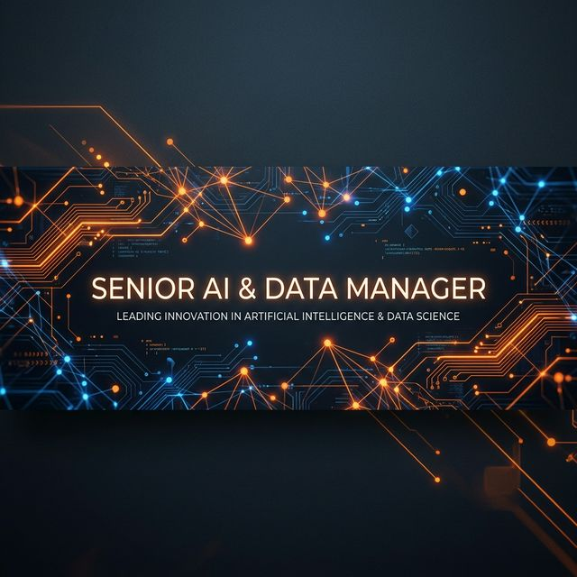

<!-- Premium Wide Header Banner -->

<h1 align="center">Rajeev Ranjan Pandey</h1>

<!-- Dynamic Typing SVG -->

<!-- Social & Social Badges Panel -->

  
  
  
  
  

 

---

## 👤 About Me

> *"I build real-world AI systems that turn complex data into clarity — at the intersection of intelligent automation, cloud engineering, and domain expertise."*

I am a **Senior Manager at Emirates NBD**, specializing in **Data Governance, Advanced Analytics, and AI-driven systems** with **20+ years of experience** across financial services, transportation, and enterprise technology.

Currently pursuing a **Master of Science in Artificial Intelligence** at [Canadian University Dubai](https://www.cud.ac.ae/).

- 🏆 **3X Tableau Zen Master** — One of the most exclusive global Tableau recognitions.
- 🌟 **5X Tableau Ambassador** — Recognized thought leader in the global Tableau community.
- ✍️ **Tableau Featured Author** — Dedicated to storytelling and insight through data visualization.
- 🤖 Building robust AI solutions combining LLMs, cloud platforms, and financial data governance.

---

## 🚀 Live Deployments

| 🚦 Traffic AI System | 📓 Notebook LM Scrub | 🌊 Dataflow Dashboard |
|:---:|:---:|:---:|
|  |  |  |

---

## ⭐ Featured Project — Traffic Incident Summarization

**Project Overview:**
AI-powered system converting traffic incident reports into concise summaries using **BART, Flan-T5, and PEGASUS** models. Analyzes real-world GCC narrative and US accident datasets with side-by-side performance metrics.

---

## 🔭 Current Focus & Focus Areas

| Project | Focus Area | Status |
|---|---|---|
| 🚦 **Traffic AI v2** | Fine-tuning domain-specific LLMs | ✅ Live |
| 📘 **MS AI Thesis** | Thermal Prediction + Intelligent Optimization | 🔬 Research |
| 🧪 **DE FlowForge** | Robust Data Pipeline Orchestration | 🚧 Dev |

---

## 🛠️ Technical Stack

---

## 📊 GitHub Ecosystem

 

 

<!-- Snake Animation -->

---

Built with ❤️ by Rajeev Pandey in Dubai • MS AI @ Canadian University Dubai

