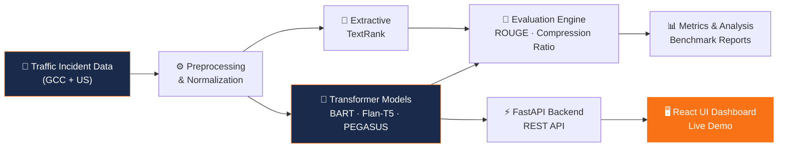

<!-- Local Premium Header Banner -->

 

<h1 align="center">Rajeev Ranjan Pandey</h1>

<!-- Typing SVG -->

<!-- Social Badges -->
 

  

---

## 👤 About Me

> *"I build real-world AI systems that turn complex data into clarity — at the intersection of intelligent automation, cloud engineering, and domain expertise."*

I am a **Senior Manager** specializing in **Data Governance, Advanced Analytics, and AI-driven systems**, with **20+ years of experience** across financial services, transportation, and enterprise technology.

Currently pursuing a **Master of Science in Artificial Intelligence** at [Canadian University Dubai](https://www.cud.ac.ae/).

---

## 🚀 Live Vercel Deployments

---

## ⭐ Featured Project — Traffic Incident Summarization

**Key Highlights:**
- 🤖 **Models:** BART-Large-CNN · Flan-T5 · PEGASUS · TextRank 
- 📈 **Performance:** Comparison of Extractive vs Abstractive summarization on real-world incident datasets.
- 🐳 **Infrastructure:** Unified container hosting React + FastAPI on Hugging Face.

---

## 🏗️ System Architecture

---

## 🛠️ Technical Stack

---

## 📊 GitHub Stats

---

*Built with ❤️ in Dubai • MS AI @ Canadian University Dubai*

