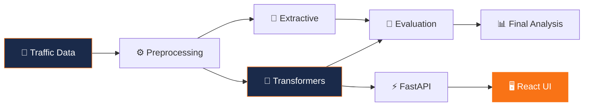

# 👨‍💻 Rajeev Ranjan Pandey
### Senior Manager — AI & Data Strategy | 3X Tableau Zen Master | 5X Ambassador

 

  

> *"Building real-world AI systems & architecting data excellence since 2004."*
> *Bridging the gap between intelligent automation and enterprise data governance.*

---

### 👤 Executive Summary

I am a **Senior Manager** specializing in **Data Governance, Advanced Analytics, and AI-driven systems**, with **13+ years of experience** across financial services, transportation, and enterprise technology. Currently pursuing a **Master of Science in Artificial Intelligence** at [Canadian University Dubai](https://www.cud.ac.ae/).

#### 🔬 Active Research & Focus Areas:
- 🏗️ **Data Center Optimization:** Leveraging AI for intelligent workload management and energy efficiency.
- 🚦 **Smart Mobility & ITS:** Applying LLMs for real-time traffic incident analysis and summarization.
- 📊 **Enterprise Strategy:** Modernizing data architecture and regulatory analytics for global scale.

---

### 🚀 Current Focus & Specialization

<table width="100%">
  <tr>
    <td width="50%" valign="top">
      <h4>🧠 AI & Machine Learning</h4>
      <ul>
        <li><b>LLM Fine-tuning:</b> BART, Flan-T5, PEGASUS, TextRank.</li>
        <li><b>Methodology:</b> Extractive vs Abstractive summarization.</li>
        <li><b>Metrics:</b> ROUGE model benchmarking & performance analysis.</li>
      </ul>
    </td>
    <td width="50%" valign="top">
      <h4>☁️ Engineering & Infrastructure</h4>
      <ul>
        <li><b>Full-Stack:</b> Integrated FastAPI + React architectures.</li>
        <li><b>DevOps:</b> Containerized scaling with Docker & HF Spaces.</li>
        <li><b>Data Strategy:</b> Governance and MDM frameworks.</li>
      </ul>
    </td>
  </tr>
</table>

---

### 💼 Work History

| Logo | Company | Designation | Duration |
| :---: | :--- | :--- | :--- |
|  | **Emirates NBD** | Senior Manager, AI & Data Strategy | Sep 2024 — Present |
|  | **AirAsia** | Technical Lead | Feb 2020 — Sep 2024 |
|  | **State Street** | Assistant Manager / Team Lead | Oct 2018 — Feb 2020 |
|  | **UnitedHealth Group** | Senior Business Analyst | Mar 2017 — Oct 2018 |
|  | **Deloitte** | IT Business Analyst | Feb 2016 — Mar 2017 |
|  | **TCS** | System Engineer | Jan 2013 — Feb 2016 |

---

### ✍️ Publication History (137 Articles)
*Documenting expertise across Tableau, Data Engineering, and MS AI research.*

  
  
  

 

<b>📈 Annual Narrative Breakdown (Expand to View)</b>

 

| Year | Count | Highlight |
| :--- | :---: | :--- |
| **2026** | 4 | AI Learning series & MS Research |
| **2024** | 24 | Data Pipelines & Cloud Infrastructure |
| **2023** | 83 | Tableau Visualizations (Global Expert Series) |
| **2020-22**| 16 | D3.js, Figma, & Python Foundations |
| **2019** | 10 | Launch into Data Storytelling |

---

### ⭐ Featured Project — Traffic Incident Summarization
*Architecting real-time summarization for Smart Mobility environments.*

| Status | Feature | Details |
| :---: | :--- | :--- |
| 🚀 | **Live Hosting** | [**View on HuggingFace**](https://huggingface.co/spaces/rajvivan/CUD-Traffic-AI) |
| 🤖 | **Core Models** | BART-Large-CNN · Flan-T5 · PEGASUS · TextRank |
| 📊 | **Benchmark** | 0.432 ROUGE-1 (35.8% above baseline) |
| 🗂️ | **Data Reach** | GCC/UAE narratives + 5k US Accident records |

 

#### 🏗️ System Architecture

---

### 🛠️ Technical Ecosystem

---

### 📊 GitHub Status & Activity

| General Stats | Language Breakdown |
| :---: | :---: |
|  |  |

 

---

Built with ❤️ by Rajeev Pandey in Dubai • MS AI @ Canadian University Dubai

